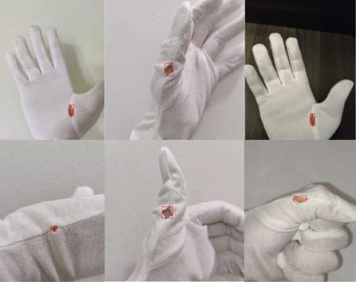
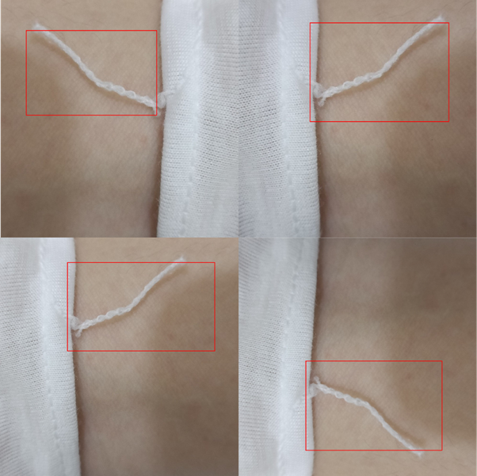
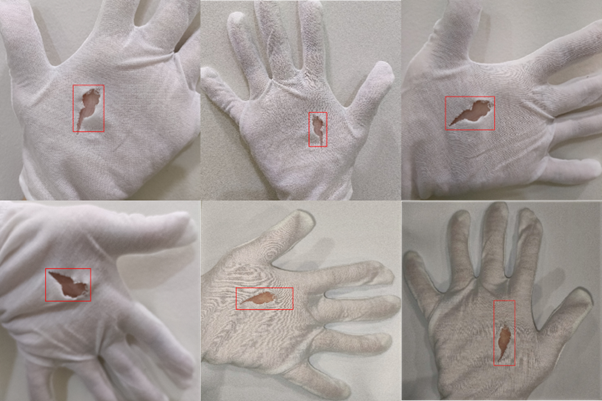

# 🧤 Gloves Defect Detection System (GDD)

A MATLAB-based image processing system designed to detect defects in various glove types using classical computer vision and pattern recognition techniques. This project was developed as part of the *Image Processing, Computer Vision, and Pattern Recognition (IPPR)* module at Asia Pacific University.

---

## 📌 Project Summary

This system aims to identify defects in **Latex**, **Cloth**, and **Foam** gloves. It leverages a wide range of MATLAB image processing functions to isolate glove regions, preprocess input images, detect defects, and annotate them with bounding boxes in a user-friendly GUI.

---

## 👥 Team Members

| Name              | ID        | Role |
|-------------------|-----------|------|
| Wong Horng Woei   | TP055241  | Cloth Glove Detection |
| Ng Eng Siong      | TP055095  | Latex Glove Detection |
| Boey Shu Wei      | TP053979  | Foam Glove Detection |

---

## 📷 Types of Detected Defects

### 🧪 Latex Gloves
- Missing Finger
- Stained and Dirty Surface
- Hole

### 🧵 Cloth Gloves
- Open Seam
- Unravelled Seam
- Tearing

### 🧽 Foam Gloves
- Cutting
- Small Wrist Thorn Cut
- Wrist Tearing

---

## 🧠 Algorithms & Techniques Used

### Preprocessing
- `rgb2hsv()` – Convert RGB to HSV color space
- `imbinarize()` – Convert grayscale to binary
- `medfilt2()` – Remove salt-and-pepper noise
- `graythresh()` – Otsu’s method for automatic thresholding

### Morphological Operations
- `strel()` – Define structuring elements
- `imclose()`, `imdilate()`, `imerode()` – Smooth edges, fill gaps
- `imfill()` – Fill internal holes
- `bwareaopen()` – Remove small objects
- `imclearborder()` – Remove objects touching borders

### Analysis
- `regionprops()` – Get bounding boxes
- `bwconncomp()` – Extract connected components
- `imcrop()` – Focus on defect regions
- `edge()`, `bwperim()` – Detect outlines and edges
- `imcomplement()` – Invert binary masks

---

## 🧪 Experimental Results

Each glove type was tested with real-world images of defective gloves. The system successfully identified and highlighted defect areas using bounding boxes. Detection remained reliable under slight environmental variations (e.g., lighting, background changes), but improvements are needed in robustness and skin tone generalization.

📌 **Highlights:**
- Accurate defect localization using bounding boxes
- Effective removal of image noise and non-defect areas
- Tailored algorithms per glove and defect type

---

## 📊 Example Results

| Glove Type | Defect | Detection Accuracy | Notes |
|------------|--------|--------------------|-------|
| Cloth      | Open Seam | ✅ High | Robust even under background changes |
| Latex      | Hole | ✅ Medium | May miss larger holes |
| Foam       | Thorn Cut | ✅ High | Best results with binary subtraction technique |

---

## 🧠 Challenges & Limitations

- **Skin Color Range Limitation**: Fixed range may fail on different hand tones
- **Single Defect Detection per Image**: Cannot detect multiple defects simultaneously
- **Visibility-Dependent Detection**: Subtle stains or holes may not be detected
- **Threshold Sensitivity**: Requires tuning based on glove material and lighting

---

## 🚀 Future Work

- Implement support for detecting **multiple defects** per image
- Expand the dataset to support diverse glove types and lighting conditions
- Introduce **adaptive thresholding** and **machine learning models (CNNs)** for better robustness
- Extend the GUI to support batch detection and export of results

---

## 🛠️ Tools & Technologies

- **Language**: MATLAB
- **Libraries**: Image Processing Toolbox
- **Framework**: Custom GUI (MATLAB)
- **Techniques**: Classical image segmentation and morphology

---

## 🔍 Sample Detection Output

---

## 📚 References

- MathWorks Documentation on Image Processing Toolbox
- Chen & Sun (2016). *Defects Detecting of Gloves Based on Machine Vision*
- Fusaomi et al. (2019). *Defect detection using deep CNN*
- Parekh (2021). *Image, Audio, and Video Processing using MATLAB*

---

## 🏁 Conclusion

This project provided hands-on experience with building a real-world image processing system using fundamental CV techniques. Through collaboration and experimentation, we successfully developed a defect detection tool applicable in industrial quality control scenarios.

---
